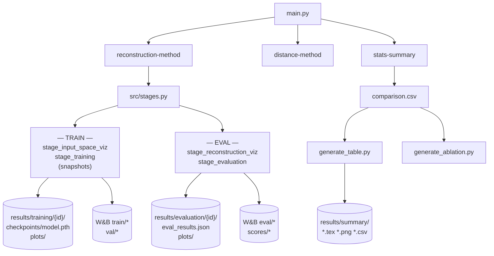

# Análisis de visualizaciones del proyecto OOD-detection-genai

Informe de inventario y evaluación de figuras, gráficas y tablas generadas por el código (archivos guardados + logging W&B + figuras en runtime).

**Formato de destino:** TFG impreso en **folio (A4), una sola columna** — no artículo de congreso a dos columnas. Las recomendaciones de estilo buscan la **esencia “paper-like”** (claridad, tipografía, vectorial, leyendas limpias, captions en LaTeX), pero el **ancho y tamaño** de cada figura deben alinearse con `\textwidth` de la memoria, no con `\columnwidth` de NeurIPS/ICML.

**Alcance:** `main.py` (3 modos), pipeline de entrenamiento/evaluación, benchmarking (`stats-summary`), scripts que invocan `stats-summary` (`scripts/experiments.sh`).

**Convención de rutas en disco:** el pipeline separa artefactos de entrenamiento y evaluación en directorios distintos, definidos en [`configs/base.yaml`](../configs/base.yaml) y sobreescritos en `main.py` al construir `experiment_id`:

| Fase | Ruta en disco | Config key |
|------|---------------|------------|
| Checkpoints | `results/training/{experiment_id}/checkpoints/` | `training.checkpoint_dir` |
| Figuras de entrenamiento | `results/training/{experiment_id}/plots/` | `viz.train_plots_dir` |
| Figuras de evaluación | `results/evaluation/{experiment_id}/plots/` | `viz.eval_plots_dir` |
| Métricas serializadas | `results/evaluation/{experiment_id}/eval_results.json` | `evaluation.results_dir` |
| Tablas y CSV agregados | `results/summary/` | argumento `--out-csv` |

El `experiment_id` se construye en `src/artifacts.build_experiment_id` y tiene la forma `{model}_{dataset}_s{seed}_lr{lr}[_t{T}]`. Las rutas de train y eval comparten el mismo `experiment_id`, lo que vincula unívocamente un checkpoint con su evaluación.

---

## Flujo general



---

## Resumen numérico

| Categoría | Cantidad | Guardado en disco | W&B |
|-----------|----------|-------------------|-----|
| Figuras en `reconstruction-method` | 14 tipos (algunos condicionales) | Sí (vía `save_figure` o `fig.savefig` en ablation) | Parcial |
| Snapshots de entrenamiento | 2 variantes (VAE / DDPM) | **No** (solo `plt.show`) | **No** |
| Tablas LaTeX (`stats-summary`) | 3 | Sí (`.tex`) | No |
| Gráfica agregada ablation | 1 | Sí (`ablation_t_auroc.png`) | No |
| Modo `distance-method` | 0 figuras | — | — |

**Artefactos no visuales relacionados:** `eval_results.json`, `comparison.csv`, escalares W&B (`train/loss_*`, `eval/*`, `scores/*_mean`).

---

## Infraestructura común

### `save_figure` ([`src/artifacts.py`](../src/artifacts.py))

- Guarda PNG con **dpi=150**, `bbox_inches="tight"`.
- Si W&B está activo: `run.log({image_key: wandb.Image(fig)})` + artifact tipo `plot`.
- **No exporta PDF/SVG.**

### Estilo matplotlib global

- Sin `matplotlibrc` de publicación: fuente/tamaños por defecto, rejilla frecuente, paleta ad hoc (`steelblue`, `tomato`, `darkorange`, etc.).
- Títulos a menudo en **inglés mezclado con español** (p. ej. ablation: “en SICAP”; tablas: “Método”).
- `figsize` habitual del código (**10–24 pulgadas de ancho**) pensado para pantalla/W&B; al insertar en LaTeX con `\includegraphics[width=\textwidth]` se **reescala** y puede perder nitidez (PNG 150 dpi) o forzar páginas rotadas.

---

## Formato TFG: folio, una columna (criterio de diseño)

### Qué significa “paper-like” en este contexto

| Sí es “paper-like” (adoptar) | No es obligatorio (congreso 2 col.) |
|------------------------------|-------------------------------------|
| Figuras vectoriales (PDF), tipografía legible (~10–11 pt en ejes) | Ancho de columna estrecha (~8 cm) |
| Poca o ninguna rejilla; paleta consistente y accesible | Panel de 8 subfiguras microscópicas por fila |
| Métricas y definiciones en **caption** LaTeX, no en título matplotlib | Densidad extrema tipo página de apéndice del paper |
| Un mensaje claro por figura | Inglés forzado si la memoria va en español |
| Barras con errorbar cuando hay varias seeds | Estilo matplotlib por defecto sin tocar |

### Dimensiones de referencia (A4, márgenes típicos de memoria)

| Magnitud | Valor orientativo | En matplotlib (`figsize`) |
|----------|-------------------|---------------------------|
| Ancho útil `\textwidth` | **14–16 cm** (~5.5–6.3 in) | `figsize=(6.0, …)` como ancho por figura completa |
| Altura máxima cómoda en una página | **10–18 cm** (evitar >20 cm) | `height` 4–7 in según paneles |
| Dos paneles lado a lado (PCA + UMAP) | ~7 cm cada uno | `figsize=(6, 2.8)` con `1×2` subplots |
| Resolución impresión | **300 dpi** (PNG) o PDF vectorial | Sustituir 150 dpi actual en export final |

En **una columna de TFG** tienes **más ancho** que en un paper de dos columnas: caben bien **2–3 subfiguras horizontales** (p. ej. ID vs OOD, orig vs recon). El límite suele ser la **altura** (grids DDPM de 6 filas) y el **exceso de paneles**, no el ancho en sí.

### Implicaciones para las figuras actuales del repo

| Figura actual | Problema respecto a TFG 1 col. | Ajuste |
|---------------|-------------------------------|--------|
| `ood_scores_*` `figsize=(16, 5×n)` | Ancho 16 in >> `\textwidth`; se reduce al importar | Regenerar a ~6 in de ancho; 1–2 filas en memoria |
| `embedding_panel` `(24, 6)` | Pensada para monitor | Memoria: `1×3` a 6×2 in o apilar vertical |
| `ablation_t_auroc` `(7×2 datasets, 5)` | Ancho 14 in si dos datasets | Un solo eje o dos subfiguras **apiladas** (6×6 in total) |
| `ddpm_timestep_grid` altura 12 in | Demasiado alta para una página | Versión compacta en memoria; full en anexo |
| Tablas LaTeX | Anchas pero escalables | `tabularx` / `\resizebox{\textwidth}` si hace falta |

### Plantilla LaTeX sugerida (memoria)

```latex
\begin{figure}[htbp]
  \centering
  \includegraphics[width=\textwidth]{figures/sicap_methods_comparison.pdf}
  \caption{AUROC en SICAP: comparación entre baselines y métodos generativos (mejor configuración por método).}
  \label{fig:sicap-methods}
\end{figure}
```

- Usar **`width=\textwidth`** (o `0.95\textwidth` si el borde queda apretado), no `width=\columnwidth`.
- Para dos paneles: `subcaption` + cada panel `0.48\textwidth`.
- Figuras muy altas: `width=\textwidth, height=0.85\textheight, keepaspectratio` en anexo.

### Configuración matplotlib orientada al TFG (propuesta)

```python
# Ejemplo: ancho = textwidth en pulgadas
TEXTWIDTH_IN = 6.0
plt.rcParams.update({
    "font.size": 10,
    "axes.labelsize": 10,
    "legend.fontsize": 9,
    "figure.dpi": 150,       # pantalla
    "savefig.dpi": 300,      # export memoria
    "savefig.bbox": "tight",
})
fig, ax = plt.subplots(figsize=(TEXTWIDTH_IN, 3.5))
```

Centralizar en `viz.textwidth_in` en `configs/base.yaml` para que `save_figure` y los generadores de benchmarking usen el mismo ancho.

---

## Inventario detallado por visualización

### A. Modo `reconstruction-method` — etapa previa al entrenamiento

#### A1. `input_space.png` — espacio de entrada (solo ID)

| Campo | Detalle |
|-------|---------|
| **Función** | `stage_input_space_viz` → `plot_embeddings` ([`src/stages.py`](../src/stages.py)) |
| **Qué muestra** | Distribución 2D de features de entrada (ID), por clase |
| **Cómo** | Scatter por proyector (`pca`, `umap` por defecto); `tab10`; puntos pequeños (`s=8`, `α=0.5`); rejilla |
| **Condición** | Solo si **no** `--skip-train` |
| **Salida** | `{plots_dir}/input_space.png`; W&B `viz/input_space` |
| **Impacto paper** | Bajo–medio (figura de dataset / motivación) |
| **Ventajas** | Muestra separabilidad previa al modelo; varios projectors |
| **Inconvenientes** | Solo ID; ejes “Dim 1/2”; figura ancha (`8×n_projectors` inch); no vectorial |
| **Mejoras** | Panel compacto; etiquetas PC1/UMAP1; una proyector en cuerpo, resto en anexo; PDF; caption con N muestras y normalización |

#### A2. `input_space_vs_ood.png` — entrada ID vs OOD

| Campo | Detalle |
|-------|---------|
| **Función** | Igual que A1, vectores ID+OOD concatenados |
| **Qué muestra** | Solapamiento ID/OOD en espacio de features antes del modelo |
| **Cómo** | Clases ID coloreadas; OOD en rojo con marcador `x` |
| **Salida** | `{plots_dir}/input_space_vs_ood.png`; W&B `viz/input_space_vs_ood` |
| **Impacto paper** | **Alto** para motivar el problema OOD en SICAP |
| **Ventajas** | Narrativa clara ID vs OOD en datos reales |
| **Inconvenientes** | Desbalance visual si OOD es una sola etiqueta agregada |
| **Mejoras** | Leyenda fuera; densidad/contornos KDE 2D; submuestreo equilibrado |

---

### B. Entrenamiento

#### B1. `training_curves.png` — curvas de pérdida

| Campo | Detalle |
|-------|---------|
| **Función** | `stage_training` ([`src/stages.py`](../src/stages.py)) |
| **Qué muestra** | `total`, `recon`, `kl` (VAE) u otras claves del dict de pérdidas por época |
| **Cómo** | Línea + `fill_between` por componente; subplots horizontales `6×n_keys` inch |
| **Condición** | Tras entrenar (no skip-train) |
| **Salida** | `{plots_dir}/training_curves.png`; W&B `train/curves` |
| **Impacto paper** | Medio (convergencia / estabilidad) |
| **Ventajas** | Desglose por término de loss |
| **Inconvenientes** | Sin val loss en la figura (val solo en W&B escalar); sin bandas de seed |
| **Mejoras** | Superponer train/val; eje log opcional; export vectorial; quitar fill para estilo minimal |

#### B2. Training snapshot — VAE (`snapshot_fig`)

| Campo | Detalle |
|-------|---------|
| **Función** | `trainer._training_snapshot` → `VAEModel.snapshot_fig` → `plot_embeddings` ([`src/models/vae.py`](../src/models/vae.py), [`src/training/trainer.py`](../src/training/trainer.py)) |
| **Qué muestra** | Latente 2D del VAE en `id_eval` a épocas `1, viz_every_n_epochs, …` |
| **Cómo** | Mismo estilo que embeddings; título `"Latent Space — epoch X/Y"` |
| **Condición** | `epoch % viz_every_n_epochs == 0` o `epoch == 1` (default cada 50 épocas) |
| **Salida** | **Solo `plt.show()`** — no `save_figure`, no W&B |
| **Impacto paper** | Bajo en forma actual (no reproducible en repo) |
| **Ventajas** | Monitoriza colapso / mezcla de clases en entrenamiento |
| **Inconvenientes** | No persistido; interactivo bloqueante en batch |
| **Mejoras** | Guardar en `plots_dir/snapshots/epoch_{e:03d}.png`; log W&B; grid fijo de épocas en figura final |

#### B3. Training snapshot — DDPM 2D toy (`_snapshot_fig_2d`)

| Campo | Detalle |
|-------|---------|
| **Función** | `DDPMModel._snapshot_fig_2d` ([`src/models/ddpm.py`](../src/models/ddpm.py)) |
| **Qué muestra** | Scatter 2D: original ID vs reconstrucción Tweedie en `noise_timestep` |
| **Condición** | `input_dim == 2` |
| **Salida** | Solo `plt.show()` |
| **Impacto paper** | Medio en toy experiments (figura didáctica) |
| **Mejoras** | Guardar PNG; panel ID/OOD si se añade OOD al snapshot |

#### B4. Training snapshot — DDPM general (`snapshot_fig`)

| Campo | Detalle |
|-------|---------|
| **Función** | `DDPMModel.snapshot_fig` |
| **Qué muestra** | 8 muestras ID: original, recon, |error| (vectores) o 2 filas (imágenes) |
| **Cómo** | Grid `n_rows × 8`; `render_cell`; timesteps fijos `[1,25,50,100,250,500,750,max_t]` por columna |
| **Condición** | No toy 2D; durante entrenamiento |
| **Salida** | Solo `plt.show()` |
| **Impacto paper** | Medio (calidad de reconstrucción por t) |
| **Inconvenientes** | Una sola fila de muestras; ruido no fijado entre épocas |
| **Mejoras** | Persistir; misma semilla de ruido que en scoring OOD |

---

### C. Reconstrucción (pre-evaluación)

#### C1. `reconstructions.png` — toy (`moons` / `blobs`)

| Campo | Detalle |
|-------|---------|
| **Función** | `_build_toy_recon_fig` → `stage_reconstruction_viz_toy` |
| **Qué muestra** | 2D: nube original vs nube reconstruida (ID azul, OOD rojo/naranja) |
| **Cuándo** | `viz_key == "toy"` en eval |
| **Salida** | `{plots_dir}/reconstructions.png`; W&B `eval/reconstructions` |
| **Impacto paper** | Alto en sección toy / sanity check |
| **Mejoras** | Flechas o líneas ID→recon por punto (opcional); igualar límites de ejes |

#### C2. `reconstructions.png` — VAE (imágenes o vectores)

| Campo | Detalle |
|-------|---------|
| **Función** | `_build_reconstruction_fig_vae` |
| **Qué muestra** | 8 ejemplos: orig/recon ID y orig/recon OOD (4×8 grid) |
| **Cómo** | `render_cell` (imagen 28×28 o trazo 1D con borde de color) |
| **Salida** | Mismo nombre que C1; W&B `eval/reconstructions` |
| **Impacto paper** | **Alto** (qualitative recon) |
| **Inconvenientes** | Solo 8 muestras; bordes de color poco habituales en papers; **demasiado denso para memoria** |
| **Mejoras** | **Versión mínima (1–2 muestras)** para memoria; **versión 8×8** para anexo (ver § Versiones mínima vs. extendida) |

#### C3. `ddpm_timestep_grid.png`

| Campo | Detalle |
|-------|---------|
| **Función** | `_build_ddpm_timestep_grid` |
| **Qué muestra** | 6 filas × (1 + keyframes): original, noisy x_t, recon por t (ID y OOD) |
| **Cómo** | Keyframes geométricos `_ddpm_keyframes`; ruido **aleatorio** por forward |
| **Salida** | `{plots_dir}/ddpm_timestep_grid.png`; W&B `eval/ddpm_timestep_grid` |
| **Impacto paper** | **Alto** para explicar mecanismo DDPM + scoring multi-t |
| **Inconvenientes** | Grid 6×(1+keyframes) muy grande; ruido no alineado con `ood_seed`; **no cabe en memoria tal cual** |
| **Mejoras** | **Versión mínima:** 1 muestra ID + 1 OOD, 2–3 timesteps clave; **anexo:** grid completo; `_fixed_noise` |

#### C4. `ddpm_denoising_trajectory.png`

| Campo | Detalle |
|-------|---------|
| **Función** | `_build_ddpm_denoising_trajectory` |
| **Qué muestra** | 4 ID + 4 OOD: x → estados reverse hasta x₀ |
| **Cómo** | `denoise_trajectory`; columnas high-t → low-t |
| **Salida** | `{plots_dir}/ddpm_denoising_trajectory.png`; W&B `eval/ddpm_denoising_trajectory` |
| **Impacto paper** | Alto (dinámica de denoising) |
| **Inconvenientes** | 8 filas (4 ID + 4 OOD) → solo viable en anexo |
| **Mejoras** | **Memoria:** 1 fila ID + 1 OOD, 3–4 columnas de t; **anexo:** trayectoria completa actual |

---

### D. Evaluación OOD

#### D1. `embedding_vs_ood.png`

| Campo | Detalle |
|-------|---------|
| **Función** | `stage_evaluation` → `plot_embeddings` |
| **Qué muestra** | Representación del modelo (latente DDPM encode o espacio VAE) ID vs OOD |
| **Condición** | `cfg.viz.plot_embeddings == True` |
| **Salida** | `{plots_dir}/embedding_vs_ood.png`; W&B `eval/embedding_vs_ood` |
| **Nota** | También `plt.show()` antes de cerrar |
| **Impacto paper** | Alto |
| **Mejoras** | Solo PCA en paper principal; UMAP en suplemento; quitar `plt.show` en batch |

#### D2. `embedding_panel.png` (solo VAE)

| Campo | Detalle |
|-------|---------|
| **Función** | `_plot_embedding_panel` |
| **Qué muestra** | Tres PCA: input raw → embedding → reconstruido (solo ID) |
| **Cómo** | `1×3`, `24×6` inch; ejes apagados (`axis off`) |
| **Salida** | `{plots_dir}/embedding_panel.png`; W&B `eval/embedding_panel` |
| **Impacto paper** | Muy alto (pipeline VAE en una figura) |
| **Inconvenientes** | Muy ancho; sin OOD |
| **Mejoras** | Versión vertical 3 filas; incluir panel OOD o diferencias |

#### D3. `ood_scores_{modes}.png` (hasta 4 archivos por experimento)

| Campo | Detalle |
|-------|---------|
| **Función** | `plot_ood_evaluation` ([`src/evaluation/plot.py`](../src/evaluation/plot.py)) |
| **Grupos** | `recon+elbo`; `latent_knn+latent_mah`; `noise_single+noise_multi_mse+noise_multi_cosine`; `residual_mah+residual_knn` |
| **Qué muestra** | Por modo activo: histograma densidad ID/OOD + KDE; curva ROC + diagonal |
| **Cómo** | Filas = modos del grupo; cols = [dist, ROC]; fig `(16, 5×n_rows)` inch; AUROC en título |
| **Salida** | `{plots_dir}/ood_scores_{mode1+mode2+...}.png`; W&B `eval/ood_scores/{modes}` |
| **Impacto paper** | **Muy alto** (resultados cuantitativos + calibración) |
| **Inconvenientes** | Figuras enormes; redundancia hist+ROC; AUROC duplicado en título |
| **Mejoras** | Una figura = un modo; PR curve opcional; estilo sin KDE; legible a `\columnwidth` |

---

### E. Modo `distance-method`

No genera figuras. Solo métricas en `eval_results.json` e impresión por consola ([`src/benchmarking/feature_distance.py`](../src/benchmarking/feature_distance.py)).

**Impacto paper:** Los baselines KNN/Mahalanobis aparecen solo en tablas agregadas (Tab comparación), no como figuras propias.

**Mejora:** Figura ROC/hist en feature space UNI para paridad con métodos generativos.

---

### F. Modo `stats-summary` — tablas y figura agregada

Invocado por `main.py --mode stats-summary` y al final de [`scripts/experiments.sh`](../scripts/experiments.sh).

#### F1. `comparison.csv` (tabla de datos, no figura)

| Campo | Detalle |
|-------|---------|
| **Función** | `run_summary` ([`src/benchmarking/generate_summary.py`](../src/benchmarking/generate_summary.py)) |
| **Qué contiene** | Una fila por (experiment_id, score) con AUROC, AUPR, FPR@95, umbrales |
| **Impacto** | Fuente única para tablas y ablation |

#### F2. `table_results_sicap.tex` (Tab 10)

| Campo | Detalle |
|-------|---------|
| **Función** | `_write_tab10_tex` ([`src/benchmarking/generate_table.py`](../src/benchmarking/generate_table.py)) |
| **Qué muestra** | Todas las configs generativas (VAE/DDPM) en SICAP: método, LR, T, score, N, mean±std |
| **Formato** | `booktabs`; 8 columnas; bloques SICAP_C1 / C12 |
| **Impacto paper** | Bajo en cuerpo (demasiado grande); **alto en anexo** |
| **Ventajas** | Exhaustivo, reproducible |
| **Inconvenientes** | Decenas de filas; mezcla español/inglés; sin `\caption`/`\label` |
| **Mejoras** | Solo top-k por método; longtable; notas al pie de T y seeds |

#### F3. `table_comparison_sicap.tex` (Tab 11)

| Campo | Detalle |
|-------|---------|
| **Función** | `_write_tab11_tex` |
| **Qué muestra** | Mejor config por método: knn, mahalanobis, vae, ddpm |
| **Formato** | Columna “Config” como texto libre (`lr=..., score=..., N=3`) |
| **Impacto paper** | **Muy alto** (tabla principal de resultados) |
| **Ventajas** | Compacta; mean±std cuando N>1 |
| **Inconvenientes** | Config no estructurada; knn/mah idénticos si mismas features |
| **Mejoras** | Columnas LR, T, Score separadas; resaltar mejor global; `\best{}` bold |

#### F4. `ablation_t_auroc.png` (Fig 12)

| Campo | Detalle |
|-------|---------|
| **Función** | `run_t_ablation` ([`src/benchmarking/generate_ablation.py`](../src/benchmarking/generate_ablation.py)) |
| **Qué muestra** | AUROC vs `n_score_steps` (T) para 3 modos DDPM en SICAP c1/c12 |
| **Cómo** | Líneas con marcadores; `ylim` dinámico; **no** pasa por `save_figure` (sin W&B) |
| **Condición** | Filas DDPM con `_t{N}` en experiment_id |
| **Impacto paper** | **Alto** (ablation T) |
| **Inconvenientes** | Título en español; sin barras de error; no vectorial; **tipo de gráfico discutible** (ver § Recomendaciones de tipo gráfico) |
| **Mejoras** | Error bars por seeds; inglés; PDF; leyenda debajo; valorar **gráfico de barras** en lugar de líneas |

#### F5. `table_ablation_t.tex` (Tab 13)

| Campo | Detalle |
|-------|---------|
| **Función** | `_write_ablation_tex` |
| **Qué muestra** | Matriz modo × T por dataset (AUROC medio) |
| **Impacto paper** | Alto (complemento numérico de Fig 12) |
| **Mejoras** | Sincronizar con CSV tras re-eval; bold en mejor celda |

---

## W&B: qué se loguea además de imágenes

### Prefijos por fase (Opción A — run único)

Todo se loguea en un único run W&B. Los prefijos de las keys crean secciones diferenciadas automáticamente en la UI:

| Fase | Prefijo | Keys actuales | Destino en disco |
|------|---------|---------------|-----------------|
| Entrenamiento | `train/` | `train/loss_*`, `train/kl_weight`, `train/lr` | `results/training/{id}/` |
| Validación | `val/` | `val/loss_total` | — |
| Snapshots *(propuesto)* | `train/snapshot/` | `train/snapshot/latent_epoch_{e}`, `train/snapshot/recon_epoch_{e}` | `results/training/{id}/plots/snapshots/` |
| Evaluación OOD | `eval/` | `eval/auroc/{mode}`, `eval/aupr/{mode}`, `eval/fpr_at_95/{mode}`, umbrales, imágenes | `results/evaluation/{id}/` |
| Medias de scores | `scores/` | `scores/id_{mode}_mean`, `scores/ood_{mode}_mean` | — |
| Artifacts | — | `eval-results` → `eval_results.json`; plots → PNG | `results/evaluation/{id}/` |

### Gestión de artifacts en reevaluación (`--skip-train`)

Cuando se reevalúa sin reentrenar, el run anterior deja artifacts de eval huérfanos. Estrategia recomendada (**A1 + A2**, sin borrado destructivo):

- **Alias `current-eval`** en el artifact: al loguear un nuevo artifact de eval, mover el alias al nuevo y retirarlo del anterior. Permite identificar en la UI cuál es la evaluación vigente de cada checkpoint sin borrar el historial.
- **Metadata `checkpoint_hash`**: incluir los primeros 10 caracteres del MD5 del `model.pth` en el metadata de cada artifact de eval. Vincula inequívocamente artifact ↔ checkpoint aunque haya varios runs sobre el mismo experimento.

Ver discusión completa en el historial del proyecto; la implementación afecta a `src/artifacts.py` (`_log_artifact`) y `src/evaluation/evaluate.py` (`evaluate_ood`).

---

## Matriz condicional (¿cuándo aparece cada figura?)

| Visualización | VAE | DDPM | Toy | MNIST/Path | SICAP |
|---------------|-----|------|-----|------------|-------|
| input_space* | ✓ train | ✓ train | ✓ | ✓ | ✓ |
| training_curves | ✓ | ✓ | ✓ | ✓ | ✓ |
| snapshot train | latent | grid/error | 2D scatter | grid | grid |
| reconstructions | 4×8 grid | — | 2D scatter | ✓ | vectores UNI |
| ddpm_* | — | ✓ | — | ✓ | ✓ |
| embedding_panel | ✓ | — | — | ✓ | ✓ |
| ood_scores_* | 2 grupos | 3 grupos | ✓ | ✓ | ✓ |
| tablas/ablation | — | — | — | — | stats-summary |

---

## Recomendaciones de tipo de gráfico

No todo lo que hoy se dibuja como línea o panel grande es el formato más legible para memoria o paper. Resumen de criterios y propuestas **aún no implementadas en código** (salvo lo ya existente).

### Ablation T (`ablation_t_auroc.png`) — líneas vs. barras

| Aspecto | Gráfico de líneas (actual) | Gráfico de barras (recomendado) |
|---------|---------------------------|----------------------------------|
| **Cuándo encaja** | T continuo, muchos puntos, tendencia suave | **T discreto** (5, 10, 25, 50): pocos niveles categóricos |
| **Lectura** | Sugiere interpolación entre T (engañosa si solo hay 4 valores) | Compara alturas por T sin implicar continuidad |
| **Varios modos** | 3 líneas pueden solaparse | Barras agrupadas (modo × T) o small multiples por dataset |
| **Incertidumbre** | Poco habitual con línea simple | Barras con errorbar (std entre seeds) muy estándar en papers |

**Recomendación:** Para SICAP, donde `T` toma valores fijos y la curva es casi plana en varios modos (p. ej. cosine, `noise_single`), un **barplot agrupado** por `T` con una barra por modo (o facetas `sicap_c1` / `sicap_c12`) comunica mejor la comparación. Reservar líneas solo si en el futuro se barre un rango denso de T.

**Implementación sugerida:** Nuevo flag en `run_t_ablation` (`chart=line|bar`) o figura adicional `ablation_t_auroc_bars.png` generada desde el mismo `comparison.csv`.

### Comparación de métodos en SICAP (nueva visualización)

Hoy la comparación global es **solo tabular** (`table_comparison_sicap.tex`). Falta una figura sintética cross-method. Opciones útiles:

| Tipo | Qué comparar | Eje / grupos | Uso |
|------|----------------|--------------|-----|
| **Barras agrupadas** | AUROC (y opcionalmente AUPR) | Eje X: método (`knn`, `mahalanobis`, `vae`, `ddpm`); color: dataset (`c1`, `c12`) | Figura principal de resultados |
| **Barras horizontales** | Mismo contenido | Etiquetas largas (`residual_mah`, etc.) | Útil en TFG 1 col. si hay muchos métodos (ocupa altura, no ancho) |
| **Dot plot / Cleveland** | AUROC ± std | Un punto por (método, dataset) | Estilo paper compacto |
| **Heatmap** | AUROC por (método × score mode) | Solo DDPM/VAE con varios scores | Anexo o análisis de modos |

**Fuente de datos:** `comparison.csv` filtrado a `sicap_c1` / `sicap_c12`, agregando por `experiment_id` la mejor fila por método (misma lógica que `_write_tab11_tex`) o mean±std si hay varias seeds.

**Nombre sugerido:** `results/summary/sicap_methods_comparison.png` (+ `.tex` opcional con mismos números que Tab 11).

**Ventaja frente a solo tabla:** El revisor captura el ranking en segundos; la tabla queda como referencia numérica exacta.

### Otras visualizaciones y tipo óptimo

| Visualización | Tipo actual | Tipo sugerido |
|---------------|-------------|----------------|
| `ood_scores_*` (ROC) | Línea ROC | Mantener línea; en memoria **un solo modo** representativo |
| `ood_scores_*` (hist) | Histograma + KDE | Memoria: solo ROC o solo hist; KDE en anexo |
| `training_curves` | Línea | Mantener; opcional barras solo si comparas pocos métodos fijos |
| `input_space_vs_ood` | Scatter 2D | Mantener; dot density en anexo si hay solapamiento |
| Tab 11 | Tabla | Mantener en memoria; **duplicar** con barplot SICAP |

---

## Versiones mínima vs. extendida (reconstrucciones y paneles)

Patrón recomendado para VAE y DDPM: generar **dos tiers** por figura cualitativa, controlados por config (p. ej. `viz.recon_n_samples_memoria: 2`, `viz.recon_n_samples_anexo: 8`).

### VAE — `reconstructions.png`

| Versión | Muestras | Layout propuesto | Destino |
|---------|----------|------------------|---------|
| **Mínima** | 1–2 ID + 1–2 OOD | `2×2` o `2×4`: fila orig / recon | **Memoria** (capítulo resultados) |
| **Extendida** | 8 ID + 8 OOD (actual `4×8`) | Grid completo + mapa de error opcional | **Anexo** (calidad cualitativa) |

La versión mínima debe usar **las mismas muestras** (índices fijados por seed) que las primeras columnas del anexo, para coherencia narrativa.

### DDPM — `ddpm_timestep_grid.png`

| Versión | Contenido | Destino |
|---------|-----------|---------|
| **Mínima** | 1 par ID/OOD; columnas: `x`, `x_t` en 1–2 t, `x̂`; máximo 4–5 columnas | **Memoria** (explicar scoring multi-t) |
| **Extendida** | 6 filas × todos los keyframes (`_ddpm_keyframes`) | **Anexo** |

### DDPM — `ddpm_denoising_trajectory.png`

| Versión | Filas | Destino |
|---------|-------|---------|
| **Mínima** | 1 ID + 1 OOD × pasos de denoising | **Memoria** |
| **Extendida** | 4+4 filas (actual) | **Anexo** |

### Toy (`reconstructions.png` 2D)

La versión actual `1×2` scatter ya es adecuada para **memoria**; no requiere anexo salvo experimentos extra.

### Implementación en código (referencia)

- Parametrizar `n_cols` / `n_rows` en `_build_reconstruction_fig_vae`, `_build_ddpm_timestep_grid`, `_build_ddpm_denoising_trajectory`.
- Sufijos de archivo: `reconstructions_compact.png` vs `reconstructions_full.png` (o subcarpeta `plots/anexo/`).

---

## Qué incluir en memoria vs. anexo

Criterio: la **memoria** debe bastar para entender problema, método, resultados principales y conclusiones sin abrir anexos. El **anexo** acumula evidencia exhaustiva, ablations completas y material repetitivo.

### Memoria (cuerpo principal)

| Elemento | Formato recomendado | Notas |
|----------|---------------------|-------|
| Motivación OOD en SICAP | `input_space_vs_ood.png` (1 panel, PCA) | Opcional si el texto ya describe UNI |
| Arquitectura / pipeline | Diagrama de bloques (no generado hoy) | Añadir aparte del repo |
| Resultados cuantitativos SICAP | **Tab 11** (`table_comparison_sicap`) + **barplot métodos** (nuevo) | Tabla + figura redundante aceptable |
| Ablation T DDPM | **Barplot** por T (mejor que líneas) o tabla `table_ablation_t` compacta | Una fila por dataset o dos subfiguras |
| Un modo OOD representativo | Una ROC (`ood_scores_*` con un solo modo, p. ej. `residual_mah` DDPM) | No los 4 PNG agrupados |
| Reconstrucción cualitativa | VAE y/o DDPM **versión mínima** (1–2 muestras) | Ilustrar capacidad del modelo |
| Entrenamiento | `training_curves.png` **o** mención en texto; figura opcional si espacio justo | |
| Toy (moons/blobs) | `reconstructions.png` 2D | Si hay capítulo de validación sintética |

**Evitar en memoria:** `table_results_sicap` completa, grids DDPM 6×N, `embedding_panel` a 24 in de ancho (reescalado), histogramas de todos los modos, snapshots de entrenamiento no guardados.

**Nota TFG 1 columna:** En memoria puedes permitir figuras algo más anchas que en un paper de 2 columnas (p. ej. barplot + leyenda al lado), pero sigue siendo mejor generarlas ya a ~`\textwidth` (6 in) para no depender de escalar PNG en LaTeX.

### Anexo

| Elemento | Motivo |
|----------|--------|
| `table_results_sicap.tex` (Tab 10) | Volcado completo lr/T/score/seeds |
| `ddpm_timestep_grid` y `ddpm_denoising_trajectory` **versión extendida** | Tamaño y detalle técnico |
| `reconstructions.png` VAE 4×8 | Muestras adicionales |
| Todos los `ood_scores_*.png` por grupo de modos | ROC + hist por cada score |
| `embedding_panel.png` (VAE) y `embedding_vs_ood` con PCA+UMAP | Exploración de representación |
| `input_space.png` (solo ID) | Complemento de A1 |
| `training_curves` + snapshots por época | Trazabilidad del entrenamiento |
| Ablación T: figura de líneas **y** tabla completa si en memoria va barplot | Comparación de formatos |
| MNIST / PathMNIST (si se ejecutaron) | Generalización fuera de SICAP |
| Hiperparámetros y `comparison.csv` | Reproducibilidad |

### Tabla resumen memoria / anexo

| Visualización / tabla | Memoria | Anexo |
|----------------------|:-------:|:-----:|
| `table_comparison_sicap` | ✓ | (opcional repetir) |
| Barplot métodos SICAP (propuesto) | ✓ | |
| `table_ablation_t` | ✓ (o solo figura) | ✓ (detalle) |
| `ablation_t_auroc` líneas | | ✓ |
| `ablation_t_auroc` barras | ✓ | |
| `table_results_sicap` | | ✓ |
| `input_space_vs_ood` | ✓ | ✓ (UMAP extra) |
| `input_space` solo ID | | ✓ |
| Recon VAE/DDPM mínima | ✓ | |
| Recon VAE/DDPM completa | | ✓ |
| `ddpm_*` grids completos | | ✓ |
| `ood_scores_*` (todos) | 1 modo | ✓ (resto) |
| `embedding_panel` | | ✓ |
| `embedding_vs_ood` | opcional | ✓ |
| `training_curves` | opcional | ✓ |
| Snapshots entrenamiento | | ✓ |
| Toy 2D recon | ✓ (si aplica) | |

### Orden sugerido en memoria (SICAP)

1. Tabla + barplot comparación de métodos (AUROC/AUPR).
2. Figura ablation T (barras, DDPM scores).
3. Una ROC del mejor método/score.
4. Panel reconstrucción compacto (VAE o DDPM según foco del trabajo).
5. (Opcional) Embedding 2D ID vs OOD.

---

## Evaluación global: esencia paper-like en TFG (1 columna)

### Fortalezas del sistema actual

1. **Cobertura completa del pipeline:** datos → entrenamiento → reconstrucción → métricas → agregación.
2. **Figuras cualitativas DDPM** (grid temporal + trayectoria) alineadas con la contribución metodológica.
3. **Tabla de comparación** (Tab 11) con formato mean±std adecuado para memoria y papers.
4. **Separación modos de score** en grupos para no mezclar VAE y DDPM en una sola figura ilegible.
5. **Ablation T** como figura + tabla duplicando la misma información (buena práctica; tipo línea mejorable → barras, ver § Recomendaciones).
6. **TFG a una columna:** permite figuras más legibles que en formato congreso (2–3 paneles horizontales sin apretar).

### Debilidades transversales

1. **Sin tema de publicación unificado** (tipografía, tamaño, color, grid).
2. **PNG 150 dpi** únicamente; sin PDF/SVG para impresión.
3. **Figuras sobredimensionadas en pulgadas** (10–24 in): pensadas para pantalla; en memoria se insertan con `\textwidth` y quedan borrosas o desproporcionadas.
4. **Persistencia inconsistente:** snapshots de entrenamiento no se guardan.
5. **Idioma mixto** (ES/EN) entre tablas y figuras — en TFG conviene **español** en captions y tablas, inglés solo en nombres técnicos si la normativa lo permite.
6. **Métricas en títulos** matplotlib en lugar de captions LaTeX (norma habitual en memoria).
7. **Baselines distance** sin figuras, solo tablas.
8. **Altura excesiva** en grids DDPM (riesgo de figura que no cabe en una página A4).

### Priorización de mejoras (impacto / esfuerzo, TFG 1 col.)

| Prioridad | Mejora |
|-----------|--------|
| P0 | `matplotlibrc` + export **PDF**; ancho figura ≈ **6 in** (`\textwidth`); `savefig.dpi=300` |
| P0 | Parametro `viz.textwidth_in` en config compartido por benchmarking y `stages` |
| P0 | Persistir snapshots de entrenamiento + W&B |
| P1 | Reducir `ood_scores_*` a 1 modo/figura o layout 2×2 compacto |
| P1 | Tab 10 solo en anexo; Tab 11 con columnas estructuradas |
| P1 | Ablation: **barplot** (T discreto) + error bars; mantener líneas solo en anexo |
| P1 | **Barplot comparación métodos SICAP** desde `comparison.csv` |
| P1 | Recon VAE/DDPM: tier `compact` (1–2 muestras) vs `full` (anexo) |
| P2 | Figuras ROC para `distance-method` |
| P2 | Paleta colorblind-safe (Tol/Okabe-Ito) |
| P2 | Quitar `plt.show()` en eval batch |

---

## Referencia rápida: archivos por directorio

Tras un run `reconstruction-method` típico (sin `--skip-train`):

```
results/training/{experiment_id}/
  checkpoints/
    model.pth
  plots/                              ← train_plots_dir
    input_space.png
    input_space_vs_ood.png
    training_curves.png
    snapshots/                        (propuesto — hoy solo plt.show)
      epoch_001.png
      epoch_050.png
      ...

results/evaluation/{experiment_id}/
  eval_results.json
  plots/                              ← eval_plots_dir
    reconstructions.png               # VAE: 4×8 grid; toy: 2D scatter
    ddpm_timestep_grid.png            # solo DDPM
    ddpm_denoising_trajectory.png     # solo DDPM
    embedding_vs_ood.png
    embedding_panel.png               # solo VAE
    ood_scores_recon+elbo.png         # según modos activos del modelo
    ood_scores_latent_knn+latent_mah.png
    ood_scores_noise_single+noise_multi_mse+noise_multi_cosine.png
    ood_scores_residual_mah+residual_knn.png
    # Propuestos (tier compacto para memoria):
    reconstructions_compact.png
    ddpm_timestep_grid_compact.png
    ddpm_denoising_trajectory_compact.png
    # Propuestos (tier extendido para anexo):
    reconstructions_full.png
    ddpm_timestep_grid_full.png
    ddpm_denoising_trajectory_full.png

results/summary/
  comparison.csv
  table_results_sicap.tex
  table_comparison_sicap.tex
  ablation_t_auroc.png
  table_ablation_t.tex
  # Propuestos (aún no en código):
  sicap_methods_comparison.png
  ablation_t_auroc_bars.png
```

> **Nota `--skip-train`:** al reevaluar sin reentrenar, `train_plots_dir` y `checkpoints/` no se tocan. Solo se sobreescriben los contenidos de `results/evaluation/{experiment_id}/`. El `experiment_id` es el mismo si no cambian modelo, dataset, seed, lr ni `n_score_steps`, por lo que los archivos anteriores de eval quedan reemplazados en disco. En W&B el artifact antiguo persiste; usar el alias `current-eval` para identificar el vigente (ver § Gestión de artifacts en reevaluación).

---

*Generado como entregable del plan de análisis de visualizaciones. No modifica el comportamiento del pipeline.*

---

## Cómo generar figuras listas para la memoria (rápido)

Las siguientes mejoras han sido implementadas en el código para facilitar la
exportación de figuras de calidad de impresión:

- `save_figure` ahora exporta PNG a `cfg.viz.savefig_dpi` (por defecto 300 dpi)
  y además guarda formatos vectoriales (`.pdf`, `.svg`).
- Añadida configuración `viz.textwidth_in` en [configs/base.yaml](../configs/base.yaml)
  (por defecto `6.0` pulgadas) para alinear `figsize` con el ancho de la memoria.
- Los *training snapshots* se guardan en `cfg.viz.train_plots_dir` en lugar de
  mostrarse en pantalla. Las figuras de evaluación ahora se guardan automáticamente
  en `cfg.viz.plots_dir` y se suben a W&B si `wandb.enabled=true`.

Ejemplos de uso (desde la raíz del repo):

```bash
# evaluar un experimento concreto y generar figuras en disk + W&B
python main.py --mode evaluation --experiment-name my_experiment

# ejecutar solo el resumen / tablas agregadas
python main.py --mode stats-summary --out-csv results/summary/comparison.csv
```

Si quieres ajustar el ancho objetivo para las figuras de la memoria edita
[configs/base.yaml](../configs/base.yaml) y cambia `viz.textwidth_in`.

Si deseas generar figuras más grandes para el anexo, usa la ruta en `results/`
para localizar las figuras (por ejemplo `results/evaluation/<experiment>/plots/`) y
convierte el `.png` generado a PDF si necesitas raster→vector adicional.
